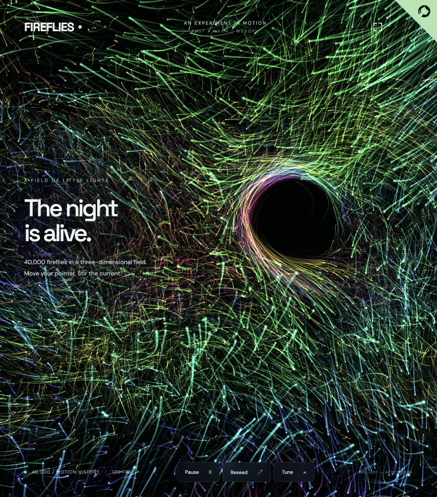

# FIREFLIES

[Live demo](https://modern-particles.pages.dev/) · [Source](https://github.com/bunnybones1/modern-particles)



40,000 fireflies in a fullscreen, interactive 3D field. Built with Vite, a dependency-free Rust WASM engine, and WebGPU compute/render pipelines.

## Run locally

Requires Node.js 20.19+ or 22.12+, Rust, and the `wasm32-unknown-unknown` target:

```sh
rustup target add wasm32-unknown-unknown
npm install
npm run wasm
npm run dev
```

Open http://localhost:5173 in a browser with WebGPU and hardware acceleration enabled.

## Controls

Move the pointer to stir nearby particles into a 3D vortex while shifting the camera. Tune adjusts speed, turbulence, and palette. Space pauses, R reseeds, H hides the interface. The upper-right button enters fullscreen.

## Architecture

Rust initializes 40,000 3D particle records with position, velocity, and individual flicker/size/color seeds. It produces a 64-byte uniform block each frame. A WebGPU compute shader updates gentle 3D drift. The renderer projects world-space light billboards with perspective, depth attenuation, individual pulses, and pointer-driven camera parallax. The default palette samples a deterministic 3D hue field: integer-hashed lattice values spaced 12.5 world units apart are blended with quintic interpolation. Color changes smoothly with position, without per-frame random color choices. The compute shader applies a localized vortex and outward force around the pointer ray, using matching camera transforms so it acts on the particles under the cursor.

Every frame clears the canvas. There is no trail texture, temporal accumulation, or motion blur. Compact halos surround crisp light cores, with tapered ribbons connecting four seconds of recorded world-space motion, at 50% tail opacity. A GPU ring buffer stores 33 positions per firefly at eighth-second simulation intervals. Ribbon vertices interpolate between the recorded positions; history resets on reseed or horizontal/vertical boundary wrapping. Front/back depth boundaries steer particles inward and reflect any overshoot, preserving their motion history. Particle state stays on the GPU, with only uniforms uploaded each frame. Canvas pixel ratio is capped at two. An instanced indexed mesh shares ribbon vertices, using 38 unique vertices per particle instead of 102. Camera trigonometry is computed once per frame and flicker once per particle, rather than repeated in the vertex shader.

## Production and Cloudflare

```sh
npm run build
npm run preview
npm run deploy
```

`npm run deploy` builds Rust/WASM and Vite, then uploads `dist` to Cloudflare Pages. The deploy script selects the Cloudflare account; authenticate with `npx wrangler login` if needed.
